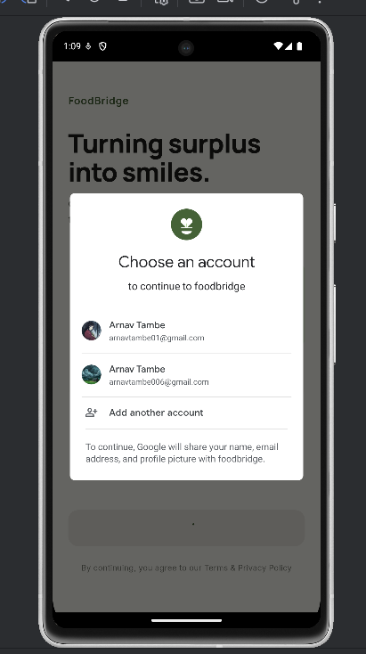
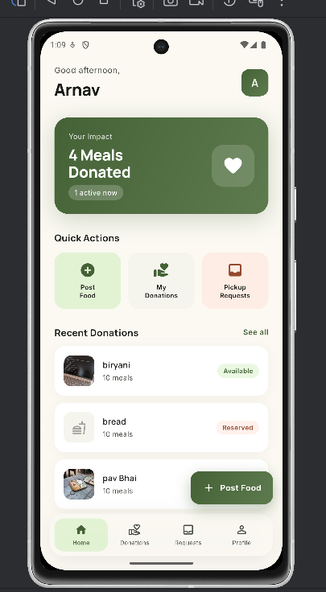
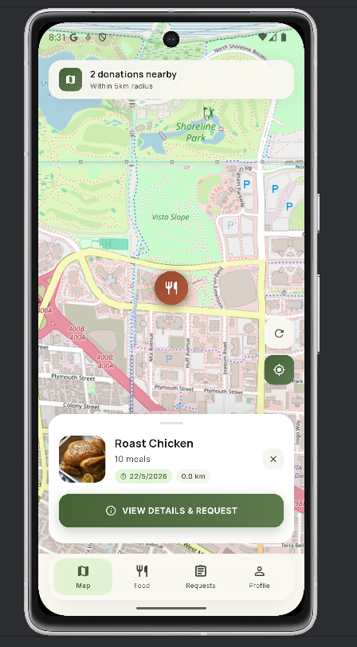

# 🍱 FoodBridge

> **Connecting surplus food donors with nearby NGOs — before it goes to waste.**

FoodBridge is a location-aware Android application that bridges the gap between food donors (restaurants, hotels, caterers, event planners) and NGOs who can redistribute surplus food to those in need. Built with Flutter and Supabase, it features real-time pickup coordination, GPS-based food discovery, and image-rich food listings.

---

## 📱 Screenshots

## 📱 Screenshots

### Login Screen


### Donor Dashboard


### NGO Nearby Food Map

---

## ✨ Features

### For Food Donors
- Post surplus food with photos, quantity, and expiry time
- GPS auto-detection for pickup location
- Accept or reject NGO pickup requests
- Real-time status updates via Supabase Realtime
- View and manage all past donations

### For NGOs
- Interactive map showing available food within 5 km
- Distance-sorted food listings with full details
- One-tap pickup request flow
- Live request status tracking (pending → accepted → completed)
- Offline-cached data for poor connectivity

### General
- Google Sign-In via Supabase Auth
- Role-based routing (Donor / NGO)
- Shimmer loading states and empty state UI
- Offline banner with retry support
- Push notifications via Firebase Cloud Messaging _(Phase 8)_

---

## 🛠️ Tech Stack

| Layer | Technology |
|-------|-----------|
| **Language** | Dart 3.x |
| **UI Framework** | Flutter 3.x |
| **State Management** | Riverpod 2.x |
| **Navigation** | GoRouter 14.x |
| **Backend / Auth / DB** | Supabase (PostgreSQL + PostGIS + Realtime) |
| **Image Storage** | Cloudinary (CDN + auto-compression) |
| **Maps** | OpenStreetMap via `flutter_map` + `latlong2` |
| **Push Notifications** | Firebase Cloud Messaging (FCM) |
| **Secure Storage** | `flutter_secure_storage` |

---

## 🗂️ Project Structure

```
lib/
├── main.dart                    # App entry point
├── app.dart                     # MaterialApp + GoRouter setup
├── core/
│   ├── constants/               # API keys, URLs, app strings
│   ├── theme/                   # AppTheme, AppColors, typography
│   └── utils/                   # Helpers, validators, error handler
├── data/
│   ├── models/                  # Food, User, PickupRequest Dart models
│   ├── repositories/            # Supabase + Cloudinary API calls
│   └── supabase_client.dart     # Supabase singleton
├── providers/                   # Riverpod providers
│   ├── auth_provider.dart
│   ├── food_provider.dart
│   └── pickup_provider.dart
└── presentation/
    ├── auth/                    # Login, Role Selection screens
    ├── donor/                   # Post Food, My Donations, Requests
    ├── ngo/                     # Map, Food Detail, NGO Requests
    ├── common/                  # Shared widgets (shimmer, banners, empty states)
    └── navigation/              # GoRouter configuration
```

---

## 🗄️ Database Schema (Supabase PostgreSQL)

### `users`
| Column | Type | Notes |
|--------|------|-------|
| `id` | UUID (PK) | From Supabase Auth |
| `name` | TEXT | Full name |
| `email` | TEXT UNIQUE | From Google OAuth |
| `role` | TEXT | `'donor'` or `'ngo'` |
| `location` | GEOGRAPHY | PostGIS POINT |
| `fcm_token` | TEXT | Firebase push token |
| `created_at` | TIMESTAMPTZ | Auto-set |

### `foods`
| Column | Type | Notes |
|--------|------|-------|
| `id` | UUID (PK) | Auto-generated |
| `donor_id` | UUID (FK) | References `users.id` |
| `food_name` | TEXT | — |
| `quantity` | TEXT | e.g. `'10 meals'` |
| `description` | TEXT | Optional |
| `image_urls` | TEXT[] | Array of Cloudinary CDN URLs |
| `location` | GEOGRAPHY | PostGIS POINT |
| `expiry_time` | TIMESTAMPTZ | — |
| `status` | TEXT | `available` / `reserved` / `completed` |

### `pickup_requests`
| Column | Type | Notes |
|--------|------|-------|
| `id` | UUID (PK) | Auto-generated |
| `food_id` | UUID (FK) | References `foods.id` |
| `ngo_id` | UUID (FK) | References `users.id` |
| `donor_id` | UUID (FK) | References `users.id` |
| `status` | TEXT | `pending` / `accepted` / `rejected` / `completed` |

---

## 🚀 Getting Started

### Prerequisites

- Flutter SDK (stable channel) — [install guide](https://flutter.dev/docs/get-started/install)
- Android Studio (latest stable) with Flutter & Dart plugins
- A physical Android device or emulator (API 30+)
- Accounts on [Supabase](https://supabase.com), [Cloudinary](https://cloudinary.com), and [Firebase](https://console.firebase.google.com)

### 1. Clone the repository

```bash
git clone https://github.com/YOUR_USERNAME/foodbridge.git
cd foodbridge
```

### 2. Install dependencies

```bash
flutter pub get
```

### 3. Configure environment variables

Create a `.env` file in the project root:

```env
SUPABASE_URL=your_supabase_project_url
SUPABASE_ANON_KEY=your_supabase_anon_key
CLOUDINARY_CLOUD_NAME=your_cloudinary_cloud_name
CLOUDINARY_UPLOAD_PRESET=your_unsigned_upload_preset
```

> ⚠️ Never commit `.env` to version control. It is already listed in `.gitignore`.

### 4. Add Firebase config

Place your `google-services.json` inside `android/app/`. Download it from Firebase Console → Project Settings → Your Apps.

> ⚠️ Do not commit `google-services.json` to a public repository.

### 5. Set up Supabase

In your Supabase project:

1. Enable the **PostGIS** extension: Database → Extensions → PostGIS → Enable
2. Run the full SQL schema from `supabase/schema.sql` in the SQL Editor
3. Create the `get_nearby_foods` RPC function (see `supabase/functions.sql`)
4. Enable **Google OAuth**: Authentication → Providers → Google
5. Enable **Row Level Security** on all tables

### 6. Run the app

```bash
flutter run
```

---

## ⚙️ Supabase RPC — Nearby Foods

The NGO map uses a PostGIS function to find food within a radius:

```sql
CREATE OR REPLACE FUNCTION get_nearby_foods(lat float, lng float, radius_metres int)
RETURNS TABLE (
  id uuid, food_name text, quantity text,
  image_urls text[], expiry_time timestamptz,
  status text, distance_m float
) AS $$
  SELECT id, food_name, quantity, image_urls, expiry_time, status,
         ST_Distance(location::geography, ST_MakePoint(lng, lat)::geography) AS distance_m
  FROM foods
  WHERE status = 'available'
    AND ST_DWithin(location::geography, ST_MakePoint(lng, lat)::geography, radius_metres)
  ORDER BY distance_m ASC;
$$ LANGUAGE sql;
```

---

## 🔐 Security

- All API keys stored in `.env` via `flutter_dotenv` — never hardcoded
- Supabase Row Level Security (RLS) enforced on all tables
- Donors can only read/write their own food rows
- NGOs cannot post food; donors cannot submit pickup requests
- Supabase anon key used in the app; service role key only in Edge Functions

---

## 📦 Key Packages

```yaml
supabase_flutter: ^2.5.0
google_sign_in: ^6.2.1
flutter_riverpod: ^2.5.1
go_router: ^14.0.0
flutter_map: latest
latlong2: latest
image_picker: ^1.1.0
cached_network_image: ^3.3.1
flutter_secure_storage: ^9.0.0
shimmer: latest
google_fonts: latest
firebase_core: ^3.3.0
firebase_messaging: ^15.1.0
flutter_dotenv: latest
```

---

## 🗺️ Development Roadmap

| Phase | Title | Status |
|-------|-------|--------|
| Phase 1 | Project Setup & Foundation | ✅ Done |
| Phase 2 | Authentication & User Roles | ✅ Done |
| Phase 3 | Core Features — Donor Side | ✅ Done |
| Phase 4 | Core Features — NGO Side | ✅ Done |
| Phase 5 | Realtime & Live Updates | ✅ Done |
| Phase 6 | UI Redesign & Polish | 🔄 In Progress |
| Phase 7 | Testing & QA | ⏳ Upcoming |
| Phase 8 | Deployment & Release | ⏳ Upcoming |

---

## 🤝 Contributing

This is a personal/academic project. Feel free to fork it and adapt it for your own use case.

---


## 👨‍💻 Author

**Arnav**  
Built with Flutter + Supabase · 2026